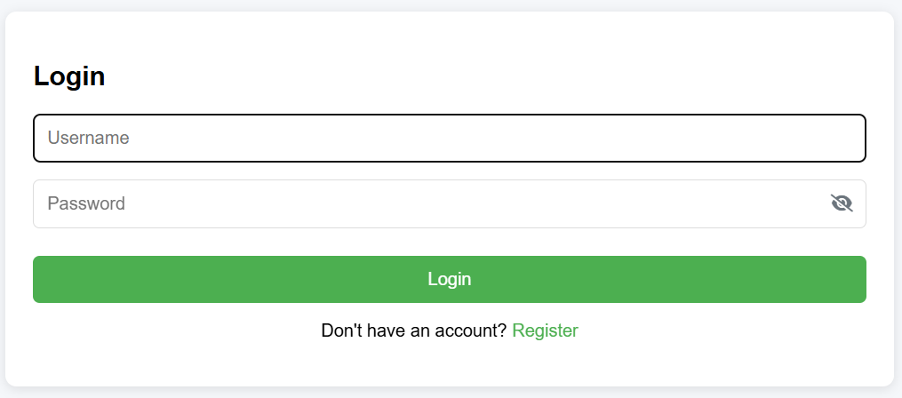

# 🔐 Go Auth

A secure authentication system built with Go, JWT, and SQLite. This application provides a complete authentication solution with user registration, login, and protected routes.


## ✨ Features

- 🔐 JWT-based authentication
- 👤 User registration and login
- 🛡️ Protected API endpoints
- 💾 SQLite database for data persistence
- 🌐 CORS support
- 🏗️ Clean architecture with separation of concerns

## 🚀 Getting Started

### Prerequisites

- Go 1.21 or higher
- SQLite3

### Installation

1. Clone the repository:
   ```bash
   git clone https://github.com/Andy6309/Go-Auth.git
   cd Go-Auth
   ```

2. Install dependencies:
   ```bash
   go mod download
   ```

3. Set up environment variables:
   ```bash
   cp .env.example .env
   ```
   Edit the `.env` file with your configuration.

### Configuration

Create a `.env` file in the project root:

```env
PORT=3010
JWT_SECRET=your_secure_secret_here
JWT_EXPIRATION=24h
DB_PATH=./db-data/auth.db
```

## 🏃 Running the Application

1. Create the database directory:
   ```bash
   mkdir -p db-data
   ```

2. Start the server:
   ```bash
   go run cmd/server/main.go
   ```

3. Access the application at `http://localhost:3010`

## 📚 API Documentation

### Authentication

- `POST /api/auth/register`
  - Register a new user
  - Request body: `{ "username": "user", "password": "password" }`

- `POST /api/auth/login`
  - Login and get JWT token
  - Request body: `{ "username": "user", "password": "password" }`
  - Response: `{ "token": "jwt.token.here", "expires_in": 86400, "token_type": "Bearer" }`

### Protected Routes

- `GET /api/profile`
  - Get current user profile
  - Requires `Authorization: Bearer <token>` header

## 🛠️ Project Structure

```
Go-Auth/
├── cmd/
│   └── server/
│       └── main.go          # Application entry point
├── internal/
│   ├── auth/                # Authentication logic
│   ├── config/              # Configuration management
│   ├── handlers/            # HTTP request handlers
│   ├── middleware/          # HTTP middleware
│   └── models/              # Data models and database operations
├── static/                  # Frontend files
│   └── index.html
├── .env.example             # Example environment variables
├── go.mod                   # Go module definition
└── README.md                # This file
```

## 🤝 Contributing

Contributions are welcome! Please feel free to submit a Pull Request.

## 📄 License

This project is licensed under the MIT License - see the [LICENSE](LICENSE) file for details.

## 📸 Screenshots

### Login Page


## 🙏 Acknowledgments

- [Gorilla Mux](https://github.com/gorilla/mux) for HTTP routing
- [Modernc SQLite](https://modernc.org/sqlite) for SQLite driver
- [JWT Go](https://github.com/dgrijalva/jwt-go) for JWT implementation
